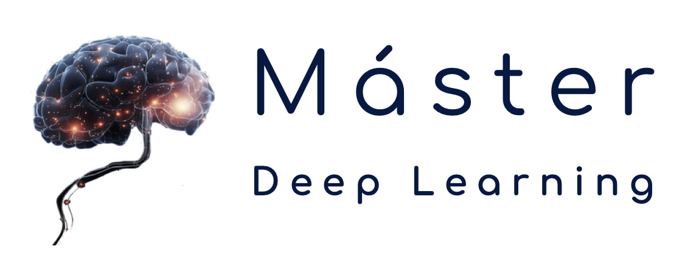

# Operalización de Machine Learning (MLOps)
Máster en Deep Learning UPM | Universidad Politécnica de Madrid | Curso 2024-25

 
 
 
 

[Español](#español) | [English](#english)

---

## Español

Este repositorio contiene el material para el curso **Operalización de Machine Learning (MLOps)**, del Máster en Deep Learning UPM por la Universidad Politécnica de Madrid (Curso 2024-25).

### Índice
- [Contenido del repositorio](#contenido-del-repositorio)
- [Contenido de la asignatura](#contenido-de-la-asignatura)

### Contenido del repositorio
- `project`: Contiene el proyecto de ejemplo de la asignatura.
- `slides`: Contiene las diapositivas del curso.

### Contenido de la asignatura
| **Parte** | **Título**                         | **Contenido**                                                              | **Diapositivas**                                                                                                                                                                                         |
|-----------|-------------------------------------------------------------------|-----------------------------------------------------------------------------|----------------------------------------------------------------------------------------------------------------------|
| **I**     | Introducción a MLOps                       | MLOps; Workflows; Infraestructura;| [Diapositivas](./slides/01_introduction.pdf)  

[Volver al índice](#índice)  | [Inicio](#)

---

## English

This repository contains the material for the course **"Machine Learning Operations" (MLOps)** of the Master in Deep Learning UPM by Polytechnic University of Madrid (Course 2024-25).

### Index
- [Repository Content](#repository-content)
- [Course Content](#course-content)

### Repository Content
- `project`: Contains the example project of the course.
- `slides`: Contains the course slides.

### Course Content
| **Part** | **Title**                           | **Content**                                                                | **Slides**                                                                                                                                                                                       |
|----------|-------------------------------------|----------------------------------------------------------------------------|-----------------------------------------------------------------------------------------------------------------------|
| **I**    | Introduction to MLOps                       | MLOps; Workflows; Infraestructure | [Slides](./slides/01_introduction.pdf)                                            |

[Back to Index](#index)   | [Top](#)
